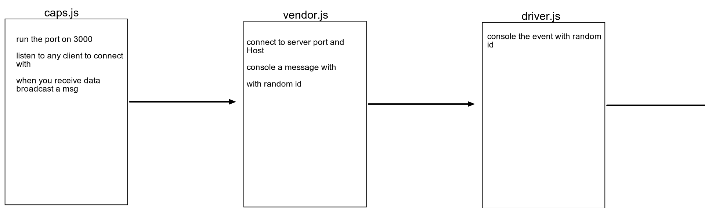

## Project: lab-17

### Author: Alaa almasri

### Links and Resources

- [submission PR](https://github.com/alaaalmasri12/caps/pull/2)

### Setup

#### `.env` requirements (where applicable)

i.e.

- `PORT` - 3000
- `Store_Name` - endgame
#### How to initialize/run your application (where applicable)

- e.g. `node caps.js`
- e.g. `node vendor.js`
- e.g. `node driver.js`

#### UML

